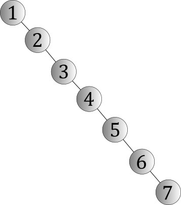

# Binary Search Tree(이진 탐색 트리)

##### 값을 키로 삼아서 찾고자 하는 키 값이 루트의 키 값과 비교하여 작으면 왼쪽서브 트리에, 키 값보다 크면 오른쪽 서브 트리에 있다.

* ### 구현

  * #### 삽입

    * 루트를 기준으로 작은 값은 왼쪽으로 큰 값은 오른쪽으로 보낸다.

  * #### 삭제: 삭제는 여러가지로 나뉘어 진다.

    ```
    //                   15                  <-- Root       //삽입 후
    //               /        \
    //              8          18
    //             / \       /    \
    //            7        17       20
    //           / \      / \      /  \
    //                           19     30
    //                          / \    /  \
    //                                29   50
    //                               / \   / \
    //                                        70
    ```

    * 삭제 대상의 자식이 없을 경우-> 그냥 삭제한다. 50경우는 그냥 삭제한다.

    * 삭제 대상의 자식이 한 방향 일 경우-> 끌어당긴다. 8을 삭제할때는 7을 8의 자리로 옮긴다음 기존의 7자리를 삭제한다.

    *  삭제 대상의 자식이 두 방향 일 경우: 삭제대상의 오른쪽 서브 트리에서 하나를 골라 삭제 자리로 올리고 골라진 자리는 삭제한다. 그래서 어떤것을 고를것인가?

      ##### 삭제 대상의 오른쪽 서브 트리의 루트 X를 기준으로 생각한다.

      * 50을 삭제할때(X의 자식이 없을 때)는 70을 50의 자리로 옮기고 70자리를 삭제한다.
      * 30을 삭제할때(X의 오른쪽 자식만 있을 때)는 50이 X가 되는 경우=> 30 자리에 50을  옮겨주고 50자리는 삭제한다.
      * 20을 삭제하면(X의 왼쪽 자식들이 있을때) X에서 왼쪽으로 계속 이동하여 마지막에 있는 숫자 29를 20자리로 옮겨주고 기존 29자리를 삭제한다.

    모든 삭제 과정에서 끊어진 포인터들은 반드시 nullptr로 초기화한다.
    

  ```c++
  #include <iostream>
  #include <cassert>
  
  struct TreeNode
  {
      int data;
      TreeNode* left;
      TreeNode* right;
      TreeNode() :
          left(nullptr),
          right(nullptr),
          data(-1) {}
  };
  
  class BST
  {
  private:
      TreeNode* root;
  
  private:
      TreeNode** allocNodes;
      int index;
      int totalCount;
  
  private:
      TreeNode* AllocNode()
      {
          assert(index + 1 < totalCount);
  
          return allocNodes[index++];
      }
  
  public:
      BST(int maxNode) :
          root(nullptr),
          allocNodes(nullptr),
          index(0),
          totalCount(maxNode)
      {
          allocNodes = new TreeNode*[maxNode];
          for (int i = 0; i < totalCount; ++i)
              allocNodes[i] = new TreeNode();
      }
  
      ~BST()
      {
          for (int i = 0; i < totalCount; ++i)
              delete allocNodes[i];
  
          delete[] allocNodes;
      }
  
  
  
      void AddData(int data)
      {
          TreeNode* newNode = new TreeNode();
          newNode->data = data;
  
          if (root == nullptr)      //루드가 비었으면
          {
              root = newNode;
              return;
          }
  
          TreeNode* cur = root;   //빈자리 찾기
          while (cur != nullptr)
          {
              if (cur->data > data)
              {
                  if (cur->left != nullptr)
                      cur = cur->left;
                  else
                      break;
              }
              else
              {
                  if (cur->right != nullptr)
                      cur = cur->right;
                  else
                      break;
              }
          }
  
          if (cur->data > data)
              cur->left = newNode;
          else
              cur->right = newNode;
      }
  
      bool FindAndRemove(int data)
      {
          TreeNode* cur = root;
          TreeNode* prev = cur;
  
          while (cur->data != data)
          {
              prev = cur;
  
              if (cur == nullptr)
                  return false;     //못찾음
  
              if (cur->data > data)
                  cur = cur->left;
              else
                  cur = cur->right;
          }
  
          //자식이 0개인 경우
          if (cur->left == nullptr && cur->right == nullptr)
          {
              if (prev->left == cur)
                  prev->left = nullptr;
              else
                  prev->right = nullptr;
  
              delete cur;
          }
          //자식이 1개인 경우
          else if (cur->left == nullptr || cur->right == nullptr)
          {
              if (prev->left == cur)  //이전 부모노드의 cur을 떼고 어디에 붙여야 하나?
              {
                  if (cur->left != nullptr)   //cur의 left에 데이터가 달려있으면
                      prev->left = cur->left;
                  else
                      prev->left = cur->right;
              }
              else
              {
                  if (cur->left != nullptr)   //cur의 left에 데이터가 달려있으면
                      prev->right = cur->left;
                  else
                      prev->right = cur->right;
              }
          }
          else//자식이 2개인 경우
          {
              TreeNode* deleteCur = cur->right;
              //오른쪽으로 한칸 내려간뒤
              //자식이 0개인 경우
              if (deleteCur->left == nullptr && deleteCur->right == nullptr)
              {
                  cur->data = deleteCur->data;
                  cur->right = nullptr;
                  delete deleteCur;
              }
              else if (deleteCur->left == nullptr)//자식이 왼쪽이 없으면 그자리에서 끌어올림
              {
                  cur->data = deleteCur->data;
                  cur->right = deleteCur->right;
                  delete deleteCur;
              }
              else
              {
                  TreeNode* prevDeleteCur = nullptr;
                  while (deleteCur->left != nullptr)
                  {
                      prevDeleteCur = deleteCur;
                      deleteCur = deleteCur->left;
                  }
  
                  cur->data =  deleteCur->data;
                  prevDeleteCur->left = nullptr;
                  delete deleteCur;
              }
          }
  
          return true;
      }
  };
  ```

  

* ### 사용 예

  ```c++
  int main(int argc, char* argv[])
  {
  
      BST b(100);
      b.AddData(15);
      b.AddData(8);
      b.AddData(18);
      b.AddData(17);
      b.AddData(20);
      b.AddData(19);
      b.AddData(30);
      b.AddData(50);
      b.AddData(29);
  
      b.FindAndRemove(18);
  
      return 0;
  }
  //                   15                  <-- Root       //삽입 후
  //               /        \
  //              8          18
  //             / \       /    \
  //                    17       20
  //                    /\     /   \
  //                          19     30
  //                          /\    /  \
  //                               29  50
  //                              / \  / \
  --------------------------------------------------------------
  //                   15                  <-- Root       //삭제 후
  //               /        \
  //              8          19
  //             / \       /    \
  //                    17       20
  //                    /\     /   \
  //                                 30
  //                                /  \
  //                               29  50
  //                              / \  / \
  ```


* ### 이진트리의 특징

  * 평균 적으로 검색을 빠르게 할 수 있다. O(logN/log2의 올림)의 속도로 찾을 수 있음.

  * 편향트리의 경우 O(N)의 속도를 가져 이진트리의 의미가 사라질 수 있음
    예)

    
    


