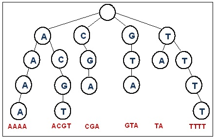

# Trie(트라이)

##### 문자열을 빠르게 찾기 위해 저장하기 위한 자료구조. 문자열을 문자 단위로 분해하여 Tree를 만든다.


* O(M)의 속도로 문자열을 찾을 수 있음.
* 순회를 통해 정렬을 할 수 있음
* 해시테이블과는 다르게 충돌이 없고 해시 함수가 필요없음





### 삽입 연산 

루트부터 문자열의 한 문자 문자를 따라서 노드를 생성한다.


### 검색

루트로 부터 문자열의 각 문자의 순서가 가르키는 노드로 이동하며 검색한다.


### 구현

```c++
#include <iostream>
#include <string>
#include <ctime>

#define MAX_LENGTH 100
#define MIN_LENGTH 20
#define STR_COUNT 10000

struct TrieNode
{
	bool isEnd;
	TrieNode* nexts[26 + 1];
	TrieNode() : isEnd(false), nexts()
	{
		memset(nexts, 0, sizeof(nexts));
	}
};

TrieNode* root = 0;;
TrieNode allocs[STR_COUNT * MAX_LENGTH + 10];
int index = 0;
TrieNode* newNode()
{
	return &allocs[index++];
}

void InitTrie()
{
	root = newNode();
}

void AddTrie(const char* str)
{
	char* cur = (char*)str;
	TrieNode* pointer = root;
	while (*cur != '\0')
	{
		if (pointer->nexts[*cur - 'a'] == 0)		//없으면 만들고
		{
			pointer->nexts[*cur - 'a'] = newNode();
		}
		
		pointer = pointer->nexts[*cur - 'a'];
		++cur;
	}
	pointer->isEnd = true;
}


char printStr[100];
void PrintSortedStr(TrieNode* currentPos,int pos)
{
	if (currentPos->isEnd)
	{
		printStr[pos] = '\0';
		std::cout << printStr << "\n";
	}

	for (register int i = 0; i < 26 + 1; ++i)
	{
		if (currentPos->nexts[i])
		{
			printStr[pos] = 'a' + i;
			PrintSortedStr(currentPos->nexts[i], pos + 1);
		}
	}
}

int main(int argc, char* argv[])
{
	//Trie 시작
	InitTrie();

	for (register int i = 0; i < STR_COUNT; ++i)
	{
		int randomLength = MIN_LENGTH + rand() % (MAX_LENGTH - MIN_LENGTH);
		std::string str;
		for (int j = 0; j < randomLength; ++j)
			str.push_back('a' + rand() % 26);

		AddTrie(str.c_str());
	}

	PrintSortedStr(root, 0);

	return 0;
}
```


## Reference

Image1:[Link](https://bioinformatics.cvr.ac.uk/trie-data-structure/)

