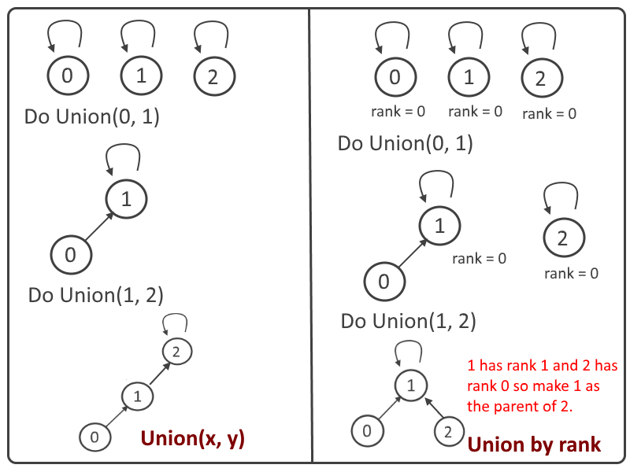

# Union-Find

Disjoint Set을 표현하는 자료구조





#### Disjoint Set

* 서로소 집합을 의미한다.
* 서로 다른 집합은 같은 원소를 포함하지 않는다.
* 바로 위를 '상호 배타적' 이라고 한다.


#### Union-Find의 기능 구현

* 트리를 통한 구현
  * Union-Find의 함수 종류
    * 초기화: 각 노드들을 자기 자신을 가르키도록 만듭니다. 가장 처음에는 각각 자신을 원소로 가지는 서로소 집합으로 있기 때문에 그 상황을 만들어준다.
    * Root 찾기: 서로소 집합 가장 최상위에 있는 원소를 반환한다. 
    * Merge: 두 서로소 집합 최상위 원소를 이용하여 두 집합을 합쳐준다 
  * 함수 구현시 주의 사항
    * 합칠때 무조건 한쪽방향으로만 연속해서 붙이게 되면 편향트리 형태로 만들어 질 수 있다.(왼쪽은 항상 높이가 크고 오른쪽은 항상 높이가 작을때, 오른쪽에 왼쪽을 합치는 방향으로 계속 간다면 높이는 계속 높아진다. O(N))
    * 이를 해결하기 위하여 각 서로소 집합의 크기를 저장하고 높이가 큰 서로소 집합에 높이가 낮은 서로소 집합을 붙이도록 하여서 높이가 매우 커지는 것을 방지한다.(깊이는 줄어드는 대신에 대부분이 Root 근처에 머물게 되어 O(logN) 정도로 검색속도가 빨라진다.)

* 배열(순차적으로 집합 표시함)을 이용한 구현
  * Union-Find 함수 는 위와 동일
  * 배열을 이용한 구현의 문제
    * Merge연산시에 순차 탐색을 통해서 각 요소들의 집합 번호를 교체해 줘야함. 트리 형태에서 루트만 교체하는 방법과 비교하여 매우 비효율적인 방법


#### 구현코드

```c++
#include <iostream>
#include <cstring>

int n, m;
int parent[1000000 + 1];
int rank[1000000 + 1];
void UnionFindInit()
{
	for (int i = 1; i < n + 1; ++i)		//자신을 가르키도록 함
	{
		parent[i] = i;
		rank[i] = 1;
	}
}

int FindParent(int x)				//최상위 루트를 찾음 
{
	return parent[x] == x ? x : FindParent(parent[x]);
}

void Merge(int x, int y)	//x과 속한 집합과 y가 속한 집합을 합침
{
	int rootX = FindParent(x), rootY = FindParent(y);
	int heightX = rank[rootX], heightY = rank[rootY];
	
	if (heightX < heightY)
		parent[rootX] = rootY;
	else if (heightX == heightY)
	{
		parent[rootX] = rootY;
		++rank[rootY];
	}
	else
		parent[rootY] = rootX;
}
```


##### 구현 확인용 문제

https://www.acmicpc.net/problem/1717


##### 입력값

```
7 8
0 1 3
1 1 7
0 7 6
1 7 1
0 3 7
0 4 2
0 1 1
1 1 1
```


##### 출력값

```
NO
NO
YES
```


#### Reference

Image1: [Link](https://algorithms.tutorialhorizon.com/disjoint-set-union-find-algorithm-union-by-rank-and-path-compression/)